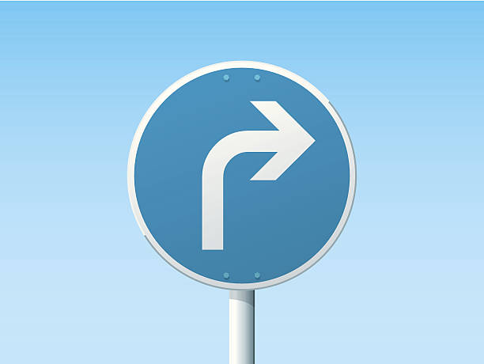

# **Traffic Sign Recognition**
---
**Build a Traffic Sign Recognition Project**

The goals / steps of this project are the following:
* Load the data set (see below for links to the project data set)
* Explore, summarize and visualize the data set
* Design, train and test a model architecture
* Use the model to make predictions on new images
* Analyze the softmax probabilities of the new images
* Summarize the results with a written report

[//]: # (Image References)

[image1]: ./visualization.png "Visualization"
[image2]: ./before_grayscaling.png "Before Grayscaling"
[image3]: ./after_grayscaling.png "After Grayscaling"
[image4]: ./ima1.jpg "Right-of-way at the next intersection"
[image5]: ./img2.jpg "Road work"
[image6]: ./img3.jpg "Turn right ahead"
[image7]: ./img4.jpg "Keep right"
[image8]: ./img5.jpg "Keep left"

## Rubric Points
---
### Writeup / README
You're reading it! and here is a link to my [project code](https://github.com/tianyeblack/CarND-Traffic-Sign-Classifier-Project/blob/master/Traffic_Sign_Classifier.ipynb)

### Data Set Summary & Exploration

#### 1. Summary statistics
I used the pandas library to calculate summary statistics of the traffic signs data set:

* The size of training set is 34799
* The size of the validation set is 4410
* The size of test set is 12630
* The shape of a traffic sign image is (32, 32, 3)
* The number of unique classes/labels in the data set is 43

#### 2. Exploratory visualization.

Here is an exploratory visualization of the data set. It is a bar chart showing how the training set is distributed:

![alt text][image1]

### Design and Test a Model Architecture

#### 1. Data Preprocessing
What techniques were chosen and why did you choose these techniques? Consider including images showing the output of each preprocessing technique

As a first step, I decided to convert the images to grayscale because mostly it's the shape of the signs that matters other than colors.

Here is an example of a traffic sign image before and after grayscaling.

![alt text][image2] ![alt text][image3]

Then, I normalized the image data by first subtracting 128 and then dividing it with 128. The grayscale numbers for each pixel are in general too large compared to neural network parameters and have a wide range (from 0 to 255). Normalization confines them to (-1, 1) and centers them around 0.

#### 2. Model architecture and parameters
Describe what your final model architecture looks like including model type, layers, layer sizes, connectivity, etc.) Consider including a diagram and/or table describing the final model.

My final model consisted of the following layers:

| Layer              		|     Description	        					            |
|:---------------------:|:---------------------------------------------:|
| Input             		| 32x32x1 Grayscale image   						      	|
| Convolution 5x5     	| 1x1 stride, valid padding, outputs 28x28x9   	|
| RELU			         		|										                         		|
| Max pooling	         	| 2x2 stride,  outputs 14x14x9 		           		|
| Convolution 5x5     	| 1x1 stride, valid padding, outputs 10x10x25  	|
| RELU			         		|										                         		|
| Max pooling	         	| 2x2 stride,  outputs 5x5x25 		           		|
| Flatten               | outputs 625                                   |
| Fully connected       | outputs 160                 									|
| RELU			         		|										                         		|
| Dropout               | Drop probability 0.5 for training             |
| Fully connected       | outputs 120                 									|
| RELU			         		|										                         		|
| Dropout               | Drop probability 0.5 for training             |
| Fully connected       | outputs 43                   									|

#### 3. Training
Describe how you trained your model. The discussion can include the type of optimizer, the batch size, number of epochs and any hyperparameters such as learning rate.

To train the model, I used an AdamOptimizer on the loss function that is the cross entropy of one hot y encodings and softmax results of the network.

* The batch size : 128
* The number of epochs : 20
* The learning rate : 0.001

#### 4. Approach to Solution
Describe the approach taken for finding a solution and getting the validation set accuracy to be at least 0.93. Include in the discussion the results on the training, validation and test sets and where in the code these were calculated. Your approach may have been an iterative process, in which case, outline the steps you took to get to the final solution and why you chose those steps. Perhaps your solution involved an already well known implementation or architecture. In this case, discuss why you think the architecture is suitable for the current problem.

My final model results were (calculated in the training session):
* training set accuracy of 0.999
* validation set accuracy of 0.965
* test set accuracy of 0.952

I chose a well-known architecture to start with:
* The architecture is based Yann LeCun's LeNet. I tuned the hyper-parameters iteratively from the input to output (a greedy algorithm instead of brutal force every combination). I changed them toward larger values (bigger model) since there are more structures and characteristics to capture. And the results validated the strategy. Then I added two Dropout layers after the two fully connected layers to combat over-fitting. It helped bring the validation accuracy from around 0.93 to 0.96.
* LeNet was developed to recognize hand-written digits, which is a finite set of shapes than resemble each other to some degree. In other words, the traffic signs share characteristics like circle/triangle/rectangle. Although the pictures' details vary (weather, backgrounds, glare and so on), the relative ratio and shape hold true. Last, the signs are usually composed of geometrical shapes, not hard-to-generalize curves and structures.
* The training accuracy indicates the model is over-fitting the training set, however, validation and test accuracies shows the model still generalizes well enough to achieve certain accuracy.

### Test Model on New Images

#### 1. Five German traffic signs

Here are five German traffic signs that I found on the web:

* The first and third images should be easy to classify since the backgrounds and light provide very clear view of the signs and high contrast.
* The second image has smaller details (the human) that may get lost in the convolution and max pooling.
* The fourth image might be difficult to classify because background scene has various structures and contrasts, which is very noise.
* The fifth image has the sign in the middle of a rectangle which is different from normal signs.

#### 2. Model's Predictions

Here are the results of the prediction:

| Image   			                                |     Prediction	                    					|
|:---------------------------------------------:|:---------------------------------------------:|
| Right-of-way at the next intersection      		| Right-of-way at the next intersection      		|
| Road work                               			| Bumpy road                										|
| Turn right ahead                        			| Turn right ahead         											|
| Keep right	                               		| Keep right                  					 				|
| Keep left                                			| Keep left                       							|

The model was able to correctly guess 4 of the 5 traffic signs, which gives an accuracy of 80%. This compares favorably to the accuracy on the test set of 12630 pictures of 0.950. As discussed above, the second picture has more details than others, which are mostly simply combination of geometrical shapes. The human shape is not as regular as other signs, therefore harder to generalize and recognize.

#### 3. Softmax Probabilities
The code for making predictions on my final model is located in the 33rd cell of the Ipython notebook.

Overall, the model is really certain about its predictions.

For the first image, the model is absolutely sure that this is a Right-of-way at the next intersection sign (probability of near 1.0), and the image does contain a Right-of-way at the next intersection sign. The top five soft max probabilities were

| Probability         	|     Prediction	        			             		|
|:---------------------:|:---------------------------------------------:|
| 1.000e+00        			| Right-of-way at the next intersection  				|
| 1.349e-11      				| Beware of ice/snow        										|
| 2.217e-14      				| Double curve               										|
| 2.195e-16        			| Pedestrians                 					 				|
| 2.067e-16    			    | Slippery road                   							|

For the second image, the model is again very certain that it is a Bumpy road sign (probability of 0.8993), but the image contains a Road work sign. It did learn these signs are similar in terms of their complex structures. The top five soft max probabilities were

| Probability         	|     Prediction	        			             		|
|:---------------------:|:---------------------------------------------:|
| 8.993e-01        			| Bumpy road                            				|
| 4.002e-02      				| Road work                  										|
| 3.148e-02      				| Bicycles crossing          										|
| 2.643e-02        			| Traffic signals              					 				|
| 1.227e-03    			    | Wild animals crossing            							|

For the third image, the model is again very certain that it is a Turn right ahead sign (probability of 0.9776), and the image does contain a Turn right ahead sign. The top five soft max probabilities were

| Probability         	|     Prediction	        			             		|
|:---------------------:|:---------------------------------------------:|
| 9.776e-01        			| Turn right ahead                              |
| 9.300e-03      				| Right-of-way at the next intersection         |
| 7.323e-03      				| Priority road          				    						|
| 1.773e-03        			| General caution              					 				|
| 1.540e-03    			    | Ahead only            					           		|

For the fourth image, the model is absolutely sure that it is a Keep right sign (probability of nearly 1), and the image does contain a Keep right sign. The top five soft max probabilities were

| Probability         	|     Prediction	        			             		|
|:---------------------:|:---------------------------------------------:|
| 1.000e+00        			| Keep right                            				|
| 2.662e-13      				| Turn left ahead                  	 						|
| 1.244e-16      				| Stop         				              						|
| 1.122e-20        			| Traffic signals              					 				|
| 8.746e-21    			    | Yield                           							|
For the fifth image, the model is absolutely sure that it is a Keep left sign (probability of nearly 1), and the image does contain a Keep left sign. The top five soft max probabilities were

| Probability         	|     Prediction	        			             		|
|:---------------------:|:---------------------------------------------:|
| 1.000e+00        			| Keep left                              				|
| 5.780e-06      				| Turn right ahead           										|
| 4.958e-07      				| Go straight or left        										|
| 8.473e-08        			| Speed limit (70km/h)         					 				|
| 5.866e-08    			    | Stop                            							|

### (Optional) Visualizing the Neural Network (See Step 4 of the Ipython notebook for more details)
####1. Discuss the visual output of your trained network's feature maps. What characteristics did the neural network use to make classifications?
